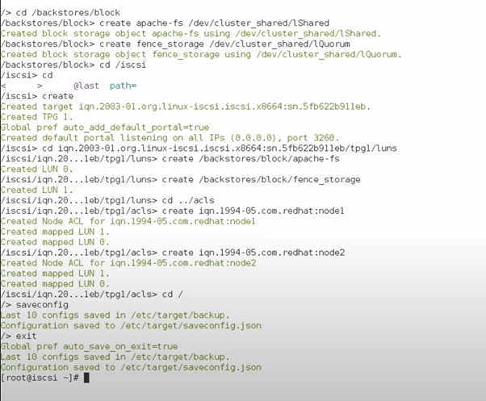
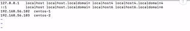
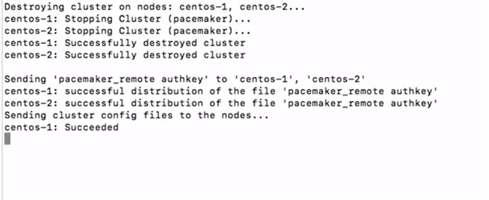
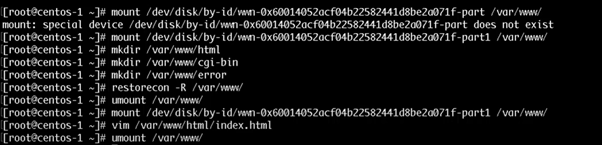
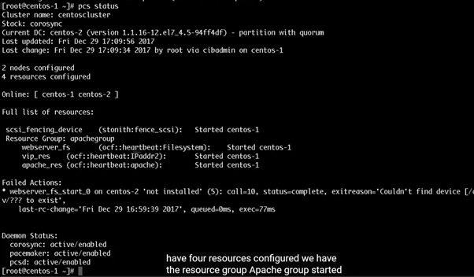
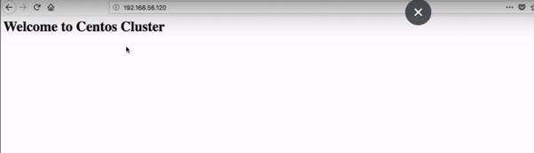
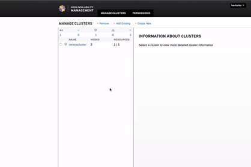
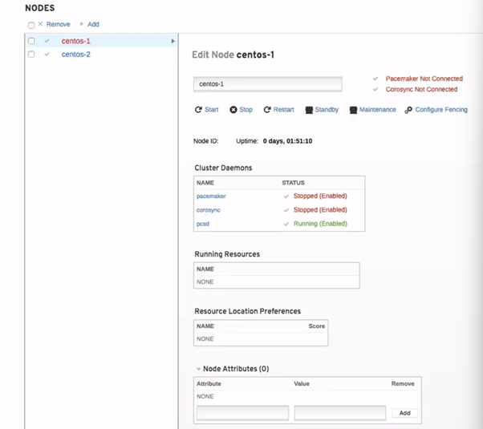
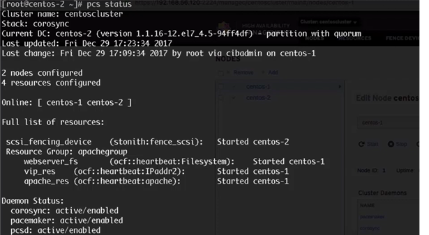

WHY USE A CLUSTER? 

- A cluster is a way of providing highly-available applications. It contains two or more machines, each hosts a replica of an application or service. For example, a web application.
 
- All machines share a common IP address called service IP or virtual IP (VIP). Any traffic received by this IP is routed to one or more of the backend machines depending on the architecture. 

- Machines in a cluster may also share storage; so that data is kept in a consistent state. 
By using a cluster, you ensure that the service is always up and running; because if one machine is down, the other machine(s) will continue to provide the service.

===========================================================================

-- We have 2 Linux Centos machine as server and 1 Linux machine will be used for shared storage. We will host web application over server. 
```
-- Machine 1: 192.168.56.102 [Node 1] -> Server 1 
-- Machine 2: 192.168.56.103 [Node 2] -> Server 2 
-- Machine 3: 192.168.56.110 [ISCSI]  -> Shared storage
-- Disk Used: SATA Disk
```

Check IP Address of Machine
	cmd:: Ip addr

===========================================================================

PREPARING THE SHARED STORAGE  : [ISCSI] 

1. Create  Volume Group which hold application files 
	cmd :: vgcreate cluster_shared /dev/sdb
2. Create Logical Volumes:
	
   Logical Disk for storage:  
	cmd :: sudo lvcreate -L 5G -n lShared cluster_shared 

	( movable logical volume between node 1 and node 2) 

   Logical Disk for Health Check: 
        cmd :: sudo lvcreate -L 1G -n lQuorum cluster_shared 
	
	(it’s one of the ways by which the hosts of a cluster determine whether or not the 	other hosts are healthy or are active ) 

3. Give Names to Each Nodes: 
	
	i. Login into  node: cmd:: ssh <IpAddress> 
	ii. sudo vim /etc/iscsi/initiatorname.iscsi
	iii. InitiatorName=iqn.1994-05.com.redhat: < nodeX> 


[[[NOTE: 

ISCSI (Internet Small Computer System Interface) in a CentOS Linux machine is a protocol that allows a system to use remote storage devices as if they were local disks. It enables block-level access to storage over a TCP/IP network. iSCSI is commonly used in enterprise environments for storage area networks (SANs).

Key Components of iSCSI in CentOS:
1.	iSCSI Initiator – The client that connects to an iSCSI target (storage server).
2.	iSCSI Target – The server that shares its storage over the network.
3.	LUN (Logical Unit Number) – The shared storage device provided by the target.
 

TargetCLI: 
targetcli is a command-line utility used for managing iSCSI targets on a CentOS system. It is part of the LIO (Linux I/O Target) framework, which allows a machine to act as an iSCSI target (server) and provide block storage over a network.


]]]

Installation of targetcli: cmd:: sudo yum install targetcli -y

Login into targetcli: 
	cmd :: targetcli

Create block storage object for apache-fs using LShared
And fence_storage using LQuorum
And then create target 
Then create luns for apache-fs and fence_storage


[[[NOTE: 
What is LUN (Logical Unit Number)?

A LUN (Logical Unit Number) is a unique identifier used to assign and manage storage devices in an iSCSI or SAN (Storage Area Network) environment. It represents a logical storage volume that is made available to the iSCSI initiator (client).

•It is a virtual representation of a physical storage device (e.g., a hard disk, SSD, or partition).
•Multiple LUNs can be created on the same storage system and shared with different clients.
•LUNs allow storage to be accessed and managed efficiently in a networked environment.


What is ACL (Access Control List)?

An ACL (Access Control List) in iSCSI is a security mechanism that controls which iSCSI initiators (clients) are allowed to access the target storage.
Key Points About ACL:
•Without an ACL, any client could connect to the iSCSI target, which is a security risk.
•The initiator IQN (iSCSI Qualified Name) is used to define ACLs, allowing only specific clients to access a target.
•ACLs can also enforce authentication (CHAP) and permissions to restrict access.

]]]

SETUP LUNS AND ACLS: 




=========================================================================


SETUP CLUSTER NODES: 

1. Install packages: 
	cmd:: yum -y install pcs fence-agents-all iscsi-initiator-utils httpd
2. Add hosts in both nodes: 
	cmd:: sudo vim /etc/hosts
	


[[[NOTE: 

pcs (Pacemaker/Corosync Cluster Suite)

-A command-line tool for managing high-availability clusters.
-Used to configure and control Pacemaker and Corosync.
-Helps manage cluster nodes, resources, and failover settings.

fence-agents-all (Fencing Agents for Cluster Nodes)

-A collection of fencing agents that protect shared resources in a clustered environment.
-Used for STONITH (Shoot The Other Node In The Head) to isolate faulty nodes.
-Prevents data corruption by ensuring that failed nodes are safely powered off or rebooted.

iscsi-initiator-utils (iSCSI Client Tools)

-Provides tools to allow a machine to act as an iSCSI initiator (client).
-Used for connecting to remote storage devices over a network.
-Commands like iscsiadm help discover and log in to iSCSI targets.

httpd (Apache Web Server)

-The Apache HTTP server package.
-Used for hosting web-based applications or cluster management UIs.
-Supports Pacemaker Web UI for monitoring cluster status.

hacluster
- hacluster is a system user created when installing Pacemaker, Corosync, and PCS (for high-availability clusters).
- It is used to authenticate cluster management commands and handle cluster services.
- This user is typically assigned to the haclient group.
]]]

2. setup hacluster with username & password

3. Change firewall rules: 
	cmd:: sudo firewall-cmd --permanent --add-service=high-availability
	   :: sudo firewall-cmd reload

4. start pacemaker service
	cmd:: sudo systemctl start pcsd.service
	   :: sudo systemctl enable pcsd.service

5. Authenticate both nodes:
	cmd:: sudo pcs cluster auth centos-1 centos-2


6. Cluster configurations:It will synchronize the certificates on both nodes & restart the pcsd on the nodes in order to reload the certificates 
	cmd:: sudo pcs cluster setup --start --name centoscluster centos-1 centos-2
	


7. Enable cluster: 
	cmd:: sudo pcs cluster enable -all
8. check cluster Status: 
	cmd:: sudo pcs cluster status

=========================================================================


CONFIGURE FENCING DEVICE: [NODE-1, NODE-2] 

Now we will configure resources that is going to be used by cluster. 
We have 2 resources . we have Ip address that is going to be share among the nodes . we also have fencing device & storage to be shared among 

1. discover available iSCSI targets on the iSCSI server: 
	cmd:: iscsiadm -m discovery -t st -p 192.168.56.110 

2. Login to arget machine 
	cmd:: iscsiadm -m node -T uniquueid -p IP -l 
3. Restart and enable iscsi: 
	cmd:: systemctl restart iscsid
	   :: systemctl enable iscsid

4. Find new disk: 
	cmd:: fdisk -l | grep sd
5. find Disk with id 
	cmd:: ls -l /dev/disk/by-id

[[NOTE:: 

STONITH (Shoot The Other Node In The Head) is a fencing mechanism used in high-availability clusters to ensure that a failed or unresponsive node is completely powered off or rebooted before the cluster takes corrective action.

 Ensures that a failed node does not continue accessing shared resources, protecting data integrity.
- Used in Pacemaker and Corosync clusters for automated node recovery.

How STONITH Works?
-Detects a node failure.
-Issues a power-off or reboot command to the failed node.
-Ensures the node is truly offline before cluster recovery.

--->>>	Fencing device is going to be responsible for the following hosts centos 1 & 2 . then we are defining monitor action to be on metadata and turning out reboot action , finally you’re giving it the device that’s going to be used for fencing 
]]


6. Create Fencing Device: 

	cmd:: Pcs stonith scsi_fencing_device fence_scsi pcmk_hosts_lis=”centos-1 centos-2” pcmk_monitor_action=”metadata” pcmk_reboot_action=”off” devices=”/dev/disk/by-id/{uniqueidofdisk} metaprovides=”unfencing”

7. Create partition of disk 
	cmd:: fdisk /dev/disk/by-id/{uniqueidofdisk} 
8. Create and mount file system to /var/www. which is default directory of apache
	cmd:: mkfs -t ext4 /dev/disk/by-id/{partitionedNewDisk} 

  	   :: mount /dev/disk/by-id/{partitionedDisk} /var/www

9. Create Directories



10. Create Resource in filesystem

	cmd:: pcs resource webserver_fs Filesystem device="/dev/disk/by-id/{newdisk}" directory="/var/www" fstype="ext4" --group apachegroup
[Ensures that if the active node fails, the disk will be automatically remounted on the standby node.]

11. Set Configuration in both nodes to check server status
	cmd:: vim /etc/httpd/conf/httpd.conf
12. allow firewall rule accepting http: 
	cmd:: sudo firewall-cmd --permanent --add-service=http
	   :: firewall-cmd --reload


[ We successfully create storage disk and added this as a resource to the cluster and the cluster is aware that it will need to mount a device under /var/www and it’s going to do this on active node . ]

13. Setup shared IP address and apache server -- start resource group & apache group 

	cmd:: pcs resource vip_res IPaddr2 ip-192.168.56.120 cidr_netmask=24 --group apachegroup
	  :: pcs resource create apache_res apache configfile="/etc/httpd/conf/httpd.conf" statusurl="http://127.0.0.1/server-status" --group apachegroup 

	  :: pcs status



=========================================================================

RESULTS: 

1. Access cluster management at https://ip/manage#



Pacemaker Manager: 



2. Start and stop any of cluster and still webpage would be up & running on another node.

	STOP CLUSTER 1: 



3. STOP CLUSTER 2
	cmd:: pcs cluster stop centos-2

4. IF SERVER 1 is restarted all resources of server-1 will be again in usage. 
 


